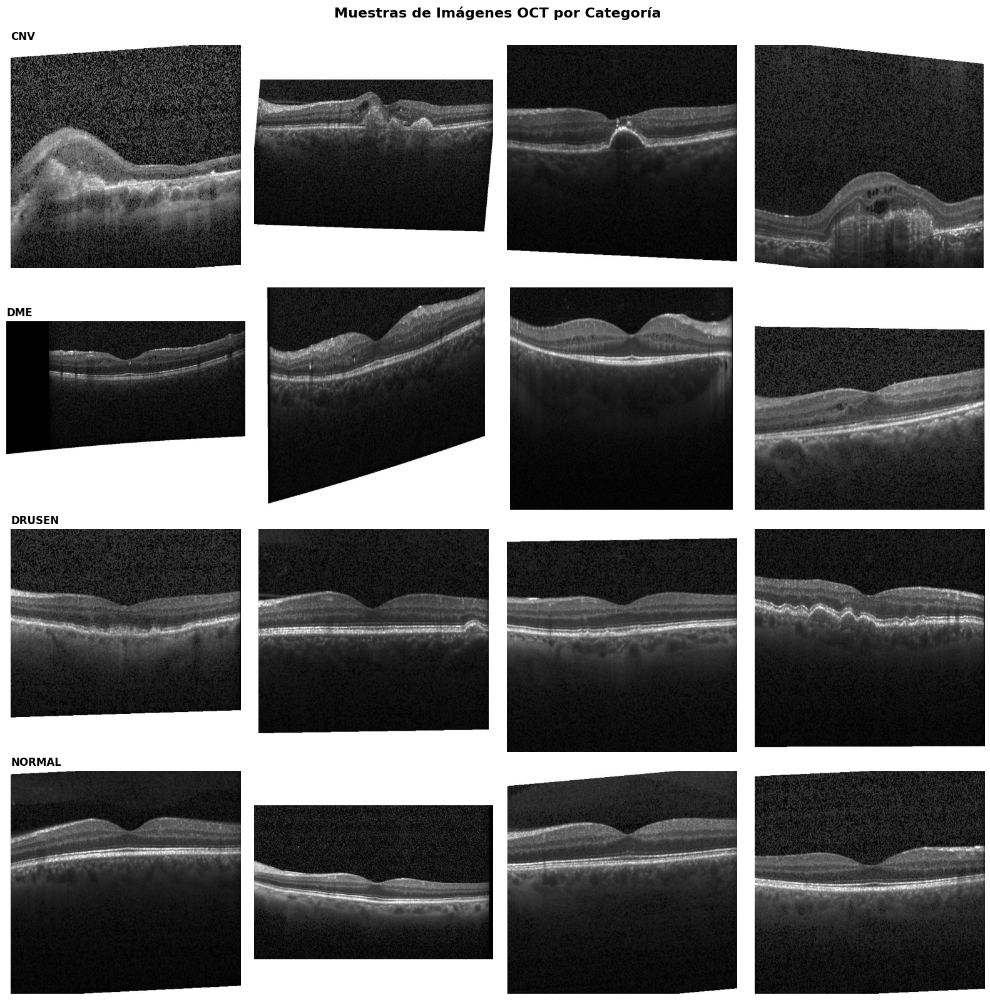

# 🔬 Clasificación de Imágenes Retinales OCT con Deep Learning

Proyecto de clasificación multiclase de imágenes médicas utilizando el dataset de Tomografía de Coherencia Óptica (OCT) retinal.

---

## 📊 Dataset

- **Fuente:** Kermany et al. (2018) - Mendeley Data V3  
  https://data.mendeley.com/datasets/rscbjbr9sj/3
- **Citación:**  
  Kermany, Daniel; Zhang, Kang; Goldbaum, Michael (2018),  
  "Large Dataset of Labeled Optical Coherence Tomography (OCT) and Chest X-Ray Images",  
  Mendeley Data, V3, doi: 10.17632/rscbjbr9sj.3
- **Total de imágenes:** 109,309 imágenes JPEG
- **Clases (4):**
  - CNV – Neovascularización Coroidea
  - DME – Edema Macular Diabético
  - DRUSEN
  - NORMAL
- **División realizada:**
  - Train: 70%
  - Validation: 20%
  - Test: 10%

### 📸 Ejemplos del Dataset

A continuación se muestran ejemplos de imágenes OCT retinales de cada una de las 4 clases:

*Muestras representativas de las 4 condiciones retinales: CNV, DME, DRUSEN y NORMAL.*

---

## 🎯 Objetivo

Construir y evaluar modelos de Deep Learning capaces de clasificar automáticamente imágenes OCT en cuatro patologías retinales.

Problema de clasificación multiclase:

f(x) → y ∈ {CNV, DME, DRUSEN, NORMAL}

En contexto médico se prioriza especialmente la **sensibilidad (recall)** para minimizar falsos negativos.

---

# 🚀 Estado del Arte (SOTA)

A continuación se resumen estudios relevantes en clasificación OCT mediante Deep Learning:

| Modelo | Dataset | Accuracy | Otras Métricas | Referencia |
|--------|----------|----------|----------------|------------|
| OCTDeepNet2 (CNN personalizado) | OCT (4 clases) | 98% | Precision 0.98, Recall 1.00, F-Score 0.99 | Rajan & Kumar (2025) |
| Modified ResNet-50 + RF (EOCT) | OCT retinal | ≈97.88%–98.47% | Sensitivity 98.36%, Specificity 96.15%, Precision 97.40% | EOCT Study |
| Attention-Based DenseNet | OCT (4 clases) | 91.67% | — | ElShafie et al. (2025) |
| Hybrid ResNet50 + EfficientNetB0 | ~84,000 imágenes OCT | 97.50% | — | Hybrid Model (Springer) |
| Transfer Learning VGG16 modificado | OCT (70/20/10 split) | 97% | — | Transfer Learning Study |

---

## 🔗 Enlaces a los artículos SOTA

- **OCTDeepNet2 – Rajan & Kumar (2025)**  
  https://link.springer.com/article/10.1007/s42979-025-03715-w  

- **Modified ResNet-50 + RF (EOCT)**  
  https://www.mdpi.com/1424-8220/23/12/5393  

- **Attention-Based DenseNet – ElShafie et al. (2025)**  
  https://link.springer.com/article/10.1007/s00521-024-10450-5  

- **Hybrid ResNet50 + EfficientNetB0 (Springer)**  
  https://link.springer.com/article/10.1007/s11042-024-19922-1  

- **Transfer Learning VGG16 modificado**  
  https://link.springer.com/article/10.1007/s12596-025-02561-6  

---

# 📊 Métricas de Evaluación

Métricas principales:
- Accuracy
- Precision por clase
- Recall por clase
- F1-Score
- Macro F1-Score
- Matriz de Confusión

Métricas complementarias:
- AUC-ROC (One-vs-Rest)
- Cohen's Kappa
- Top-k Accuracy

En aplicaciones médicas es especialmente relevante:
- Alta sensibilidad (recall)
- Buena especificidad
- Control de falsos negativos

---

# � Resultados de Modelos

## Modelos Implementados

| Modelo | Parámetros/Nodos | Detalles | Acc Train | Acc Validación | Acc Test |
|--------|------------------|----------|-----------|----------------|----------|
| Modelo Lineal (Regresión Logística) | 49,156 parámetros | Imágenes 64×64 escala grises | 0.6879 | 0.6024 | 0.6021 |
| Árbol de Decisión | 875 nodos | Profundidad: 20 | 0.6875 | 0.6072 | 0.6027 |

---

# �🛠️ Tecnologías Utilizadas

- Python 3.x
- TensorFlow / Keras
- scikit-learn
- Pandas & NumPy
- Matplotlib & Seaborn
- Kagglehub

---

# 👨‍💻 Autor
Pablo López Domínguez

Proyecto desarrollado como parte de la asignatura de Deep Learning  
Grado en Ciencia de Datos – Universitat de València  

Última actualización: Febrero 2026